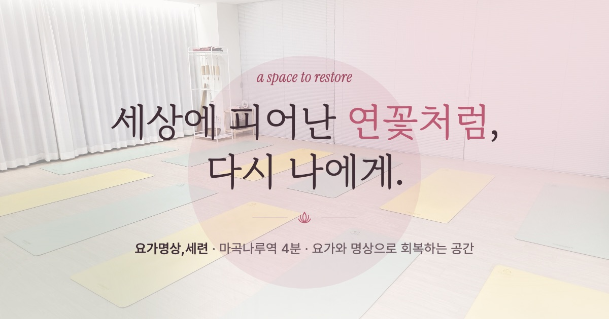

# 요가명상,세련 — 브랜드 웹사이트 & 홍보 영상

> **SR : A Space To Restore** — 요가와 명상으로 회복하는 공간, 마곡나루 요가명상세련의 공식 홍보 웹사이트와 브랜드 필름

**라이브**: https://yoga-seryun.vercel.app



## 프로젝트 개요

서울 강서구 마곡나루역 4분 거리의 요가·명상 스튜디오 "요가명상,세련"의 디지털 브랜드 자산 일체입니다.
네이버플레이스·인스타그램에서 유입된 방문자를 **1회 무료 체험 예약(네이버 예약)**으로 전환시키는 것이 목표입니다.

디자인 컨셉은 **"세상에 피어난 연꽃 (Lotus at Dawn)"** — 상호 세(世)+련(蓮)에서 도출한
웜 화이트 × 로터스 로즈 팔레트에, 호흡 템포(들숨 4초·날숨 6초)의 모션 시스템을 얹었습니다.
네이버플레이스·공식 블로그·리뷰 85건 딥리서치를 기반으로 기획했습니다 (`docs/01-plan/`).

```
.
├── docs/01-plan/                       # 기획서 2종
│   ├── yoga-seryun-website.plan.md     #   웹사이트 (딥리서치 + 부록A 빌드 프롬프트 + 부록B 모션 설계)
│   └── yoga-seryun-promo-video.plan.md #   홍보 영상 (콘티·오디오 설계·씬 분해)
├── site/                               # ① 웹사이트 (React + Vite)
└── video/                              # ② 홍보 영상 (Remotion)
```

---

## ① 웹사이트 (`site/`)

### 주요 기능
- **인터랙티브 시간표** — 요일 탭(모바일)/주간 그리드(PC), 현재 시각 기준 "다가오는 수업" 자동 하이라이트, 레벨 5색 도트·담당 강사 표기
- **브랜드 필름 섹션** — 아치형 프레임의 세로 영상(원장님 목소리), 클릭 재생·소리 안내, `preload=none` 최적화
- **스크롤 단어 리빌** — 브랜드 스토리가 스크롤에 따라 단어 단위로 떠오름 (蓮 워터마크 패럴랙스)
- **시그니처 모션** — 히어로의 숨 쉬는 원 + 낙하 연꽃잎 + 새벽빛 앰비언트 글로우. **순수 CSS keyframes 구동**이라 기기의 '동작 줄이기' 설정과 무관하게 재생 (기타 진입 모션은 접근성 설정 존중)
- **전환 장치** — 네이버 예약 딥링크 CTA, 네이버 톡톡·전화 플로팅 버튼, 실제 리뷰 85건 신뢰 블록, 리뉴얼 이벤트 가격표
- **SEO/공유** — LocalBusiness JSON-LD, 브랜드 OG 이미지(1200×630), 연꽃 파비콘(SVG + apple-touch-icon)

### 기술 스택
React 18 · Vite 5 · TypeScript · Tailwind CSS v4 · Framer Motion · Vercel
서체: MaruBuri(한글 세리프) · Pretendard(본문) · Instrument Serif(영문 이탤릭) — 동적 서브셋 CDN

### 개발 & 배포
```bash
cd site
npm install && npm run dev        # 개발 서버
npm run build                     # 타입체크 + 빌드
vercel deploy --prod --yes        # 프로덕션 배포
```

### 콘텐츠 수정 가이드 (비개발자용)
| 바꾸고 싶은 것 | 수정 위치 |
|---|---|
| 수업 시간표 | `site/src/data/schedule.ts` |
| 가격·이벤트 / 리뷰 / FAQ / 링크 | `site/src/data/content.ts` |
| 히어로 영상 | `content.ts`의 `HERO_VIDEO_URL` (비어 있으면 사진 켄번즈) |
| 사진 / 브랜드 필름 | `site/public/media/` 교체 |

---

## ② 홍보 영상 (`video/`)

**48초 · 1080×1920(9:16) · 30fps** — 릴스/쇼츠/네이버 클립용 브랜드 필름.
**원장님 육성**(세련TV 쇼츠에서 추출·전사)이 전체를 이끌고, 문장 경계(0/9/14/21초)에 씬이 동기화됩니다.
SFX(싱잉볼·차임·브레스 우시·페이퍼·패드)는 전부 **ffmpeg으로 직접 합성**해 저작권 이슈가 없습니다.

### 씬 구성 (8씬)
싱잉볼 오프닝 → 수련실 켄번즈(육성①) → 워드 리빌(육성②) → 연꽃 로고 개화(육성③)
→ 숨 쉬는 원+꽃잎(육성④) → 수업 태그 → 리뷰 85건 카운트업 → 무료체험 오퍼·엔드카드

### 편집 구조 (씬 단위 분해)
| 하고 싶은 편집 | 수정 위치 |
|---|---|
| 씬 길이·순서 | `video/src/config/timeline.ts` — 숫자만 바꾸면 뒤 씬 자동 밀림 |
| 자막·문구 | `video/src/config/script.ts` |
| 음성·SFX 타이밍/볼륨 | `video/src/AudioTracks.tsx` |
| 색·폰트 | `video/src/config/theme.ts` |

### 렌더
```bash
cd video
npm install
npm run studio                                  # 실시간 프리뷰 (씬별 컴포지션 등록됨)
npx remotion render S05Breath out/s05.mp4       # 씬 단독 렌더
npx remotion render Promo48 out/promo-48s.mp4 --codec h264 --timeout 120000 --concurrency 2
```

산출물: `video/out/promo-48s.mp4` (git 미포함) → 웹용은 720×1280로 압축해 `site/public/media/brand-film.mp4` 배치.

> ⚠️ 원장님 음성은 본인 채널(세련TV) 영상에서 추출 — **외부 게시 전 원장님 사용 동의 확인 필수.**

---

## 작업 히스토리 요약

1. **딥리서치** — 네이버플레이스·블로그·리뷰 85건·유튜브 분석, 디자인 벤치마킹, 한국 로컬비즈 웹 생태계 조사 → 기획서
2. **웹사이트 구축** — 화이트·핑크(연꽃) 테마 원페이지, 인터랙티브 시간표, 전환 퍼널 → Vercel 배포
3. **모션·배경 v2** — 새벽빛 글로우, 낙하 꽃잎, 蓮 워터마크 패럴랙스, 스크롤 반응 내비게이션
4. **호환성 픽스** — 꽃잎·숨 쉬는 원을 순수 CSS로 전환 (동작 줄이기 기기 대응)
5. **브랜드 에셋** — 연꽃 파비콘, OG 공유 이미지
6. **홍보 영상** — 원장님 음성 추출·전사, Remotion 8씬 구현, SFX 합성, 48초 렌더
7. **필름 섹션** — 홈페이지에 아치 프레임 영상 플레이어 통합

## 남은 작업 (TODO)

- [ ] 원장님 음성 사용 동의 확인 (영상 SNS 게시 전)
- [ ] 히어로 영상 실촬영본 교체 (`HERO_VIDEO_URL`)
- [ ] 카카오톡 채널 개설 시 플로팅 버튼 링크 교체 (현재 네이버 톡톡)
- [ ] 강사(나영·시소) 약력 확보 시 Teachers 섹션 추가
- [ ] 커스텀 도메인 연결 (예: yogaseryun.kr)
- [ ] 네이버 서치어드바이저 등록 + 스마트플레이스 홈페이지 슬롯 URL 역연동
- [ ] 15초 컷다운·16:9 가로판 영상 파생 (광고·플레이스용)

## 링크

- 네이버플레이스: https://map.naver.com/p/entry/place/2088771512
- 네이버 예약(무료 체험): https://m.booking.naver.com/booking/6/bizes/1676272
- Instagram: https://www.instagram.com/yoga_seryun · Blog: https://blog.naver.com/mindful_yoga_seryun · YouTube: https://www.youtube.com/@SeryunTV
